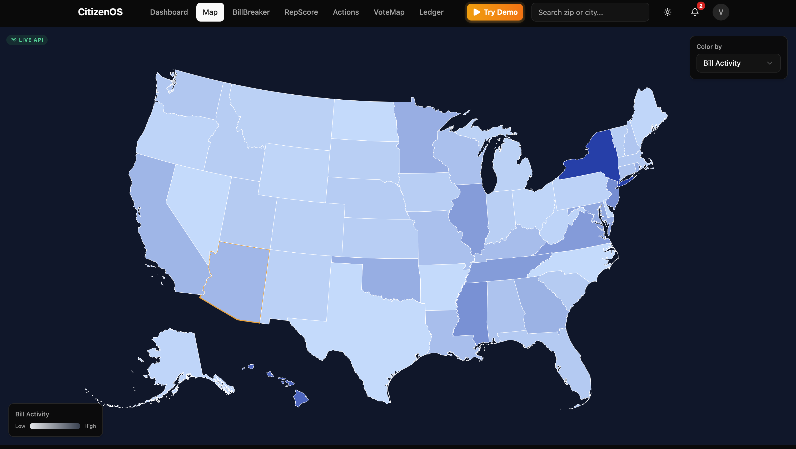
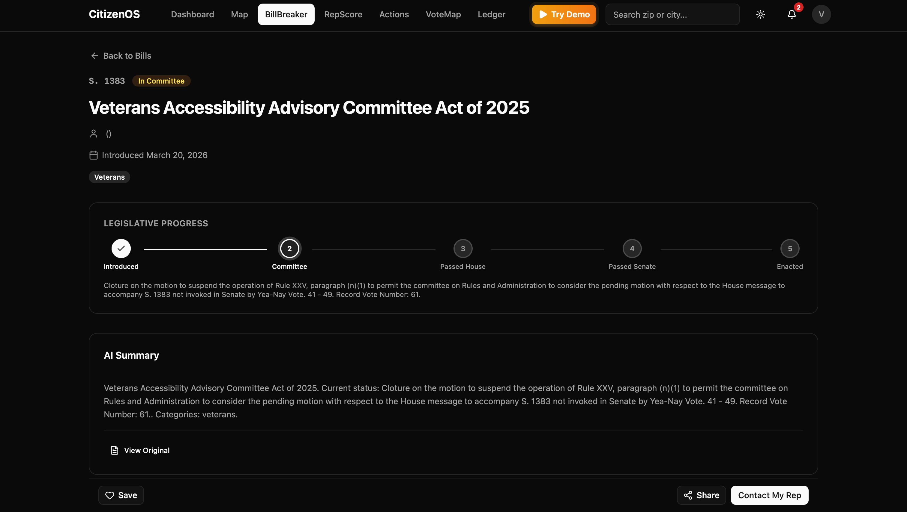
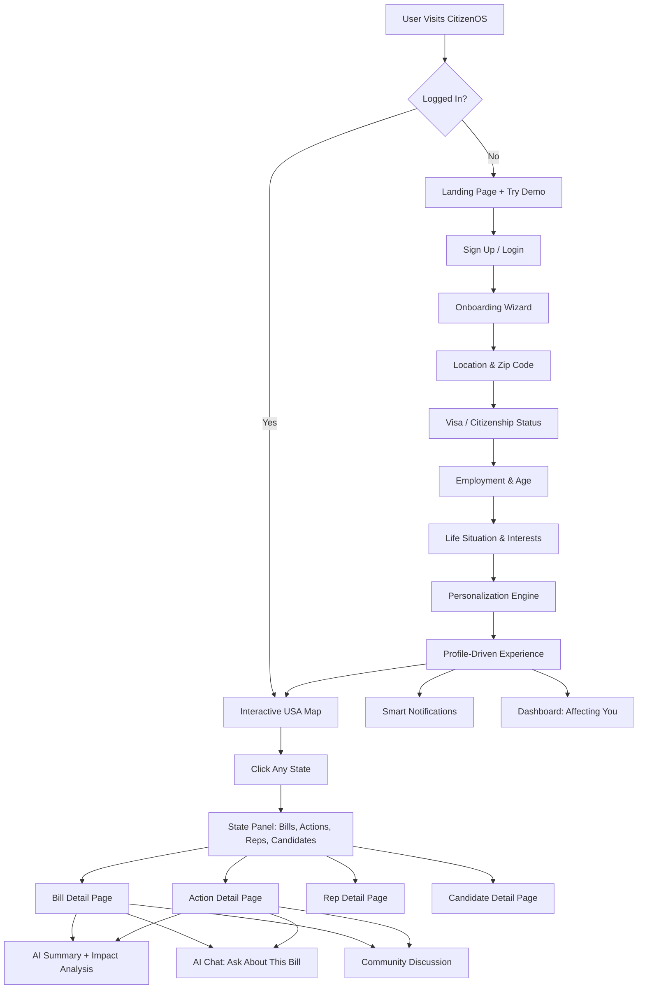
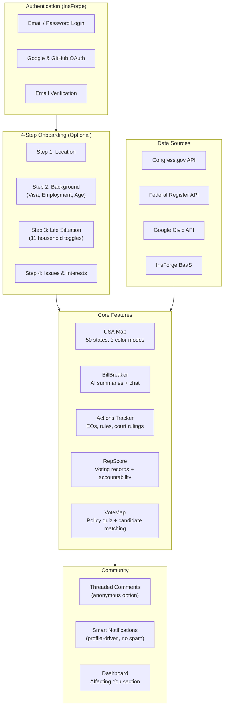

# CitizenOS

**Governance & Collaboration — Claude ASU Hackathon 2026**

> *How can you help people participate in democracy, work together across differences, or make collective decisions?*

CitizenOS is a civic engagement platform that makes US policy accessible and personal. It breaks down complex legislation into plain English, tracks government actions in real time, scores representatives on accountability, and matches voters to candidates — all personalized to each user's life situation.

Democratic institutions are strained. Polarization makes productive dialogue difficult. Civic participation is down because people feel powerless or confused. CitizenOS solves this by turning policy into something personal: if you're an F-1 student, you see the bills affecting your visa. If you're a veteran, you see VA funding changes. If you're a small business owner, you see how tariffs hit your bottom line.

## Screenshots

### Interactive USA Map
Explore bill activity, party control, and civic engagement across all 50 states. Click any state to see its bills, government actions, representatives, and candidates. The map uses live data from Congress.gov and the Federal Register, with color-coded intensity showing legislative activity. Your home state is highlighted with a gold border.



### BillBreaker — Bill Detail Page
Every bill gets an AI-generated plain-English summary, a visual legislative progress timeline (Introduced → Committee → House → Senate → Enacted), and action buttons to save, share, or contact your representative. The detail page also includes personalized impact analysis, an AI chat to ask questions, and a community discussion section.



## How It Works



## Personalization Pipeline

The core differentiator of CitizenOS is that **the same platform delivers completely different experiences** based on who you are. This is powered by a scoring engine that maps your profile to relevant content.

```mermaid
flowchart LR
    subgraph Profile
        V[Visa Status<br/>F-1, H-1B, DACA, etc.]
        E[Employment<br/>Student, Self-Employed, etc.]
        H[Household<br/>Parent, Renter, Veteran, etc.]
        AG[Age Group]
        L[Location / State]
        I[Issue Interests]
    end

    subgraph Engine["Relevance Scoring Engine (0-100)"]
        C1[Category Overlap<br/>max 40 pts]
        C2[Keyword Match<br/>max 30 pts]
        C3[Persona Match<br/>max 15 pts]
        C4[State Relevance<br/>5 pts]
        C5[Impact Level<br/>max 10 pts]
    end

    subgraph Output
        N[Personalized Notifications]
        D[Dashboard: Affecting You]
        R[Relevance Reasons<br/>e.g. Relevant to you: h-1b, visa fee]
    end

    Profile --> Engine --> Output
```



**Example**: A user on an H-1B visa who is a homeowner in California will see:
- Bills about immigration reform, visa fees, and housing policy
- Government actions on USCIS rule changes and property tax
- Notifications like *"Relevant to you: h-1b, visa fee"*
- A dashboard showing only the top bills and actions that match their profile

Users who skip onboarding see general content. Users who complete it get a fully personalized experience. A persistent banner and notification remind users to complete their profile.

## AI Chat

Every bill and government action has an **AI-powered chat** where users can ask questions in plain English:

- *"Does this bill affect my taxes?"*
- *"When does this take effect?"*
- *"How does this impact students on F-1 visas?"*
- *"Are there any exemptions?"*

The chat understands the context of the specific bill or action being viewed and provides answers grounded in the legislation text. This turns dense legal documents into a conversation — making policy truly accessible to everyone.

## Community Discussion

Bills and government actions have a **threaded comment section** where logged-in users can discuss policy:

- Comment as yourself or **anonymously** (toggle per comment)
- Threaded replies up to 3 levels deep
- Edit and delete your own comments
- Long comments (50+ words) auto-collapse with "Show more"

This enables the kind of productive civic dialogue that the hackathon theme calls for — people working together across differences to understand policy.

## Core Modules

### BillBreaker
Breaks down complex legislation into plain English. AI-generated summaries, personalized impact analysis by persona (student, veteran, parent, etc.), real-world impact stories, and an AI chat to ask any question about the bill.

### Government Actions Tracker
Tracks all types of government actions beyond bills — executive orders, presidential proclamations, agency rules, court rulings, tariffs, and more. Each action has AI summaries, timeline tracking, legal challenge monitoring, and personalized impact analysis.

### RepScore
Accountability scoring for representatives. Track voting records, campaign promise fulfillment, party loyalty, and attendance. Compare representatives side-by-side, view funding sources, and contact them directly through generated emails.

### VoteMap
Policy quiz that matches you with candidates based on your values. Radar chart comparisons, side-by-side candidate views, funding sources, endorsements, and policy alignment breakdowns.

### Interactive USA Map
Clickable SVG map of all 50 states. Click any state to explore its bills, government actions, representatives, and candidates through a slide-out panel with tabbed navigation. Color modes show bill activity, party control, or civic engagement scores.

### Interactive Demo
Non-logged-in users can **Try Demo** to experience CitizenOS through 4 different personas (H-1B visa holder, gig worker, college student, small business owner). The demo walks through every feature with guided narration, animated cursor, and spotlight highlighting — showing how the same platform delivers completely different experiences based on who you are.

## Application Workflow



## Tech Stack

| Category | Technology |
|----------|-----------|
| Framework | React 19 |
| Build Tool | Vite 8 |
| Language | TypeScript 5.9 |
| Styling | Tailwind CSS 4 |
| UI Components | shadcn/ui (Radix UI) |
| State Management | Zustand |
| Routing | react-router-dom 7 |
| Maps | react-simple-maps |
| Charts | Recharts |
| Icons | Lucide React |
| Auth & Backend | InsForge (BaaS) |
| Deployment | Vercel |
| AI | Claude (via InsForge AI integration) |

## Getting Started

### Prerequisites

- Node.js v18+
- npm

### Installation

```bash
git clone https://github.com/Manan-Santoki/claude-asu-hackathon.git
cd claude-asu-hackathon

# Install root dependencies
npm install

# Install app dependencies
cd citizenos
npm install
```

### Environment Setup

```bash
cp .env.example .env
```

Required:
```
VITE_INSFORGE_BASE_URL=       # InsForge backend URL
VITE_INSFORGE_ANON_KEY=       # InsForge anonymous key
```

Optional (for live data):
```
VITE_CONGRESS_GOV_API_KEY=    # Congress.gov API (bill data)
VITE_GOOGLE_CIVIC_API_KEY=    # Google Civic API (representatives)
```

### Run Locally

```bash
cd citizenos
npm run dev
```

Open **http://localhost:5173**

### Production Build

```bash
npm run build     # TypeScript check + Vite production build
npm run preview   # Preview locally
npm run lint      # Run ESLint
```

## Routes

| Path | Page |
|------|------|
| `/` | Landing Page (logged out) / Map (logged in) |
| `/map` | Interactive USA Map |
| `/bill` | Bill Search & Browse |
| `/bill/:id` | Bill Detail (AI summary, chat, impact, comments) |
| `/actions` | Government Actions Search |
| `/action/:id` | Action Detail (timeline, legal challenges, chat, comments) |
| `/reps` | Representative Dashboard |
| `/rep/:memberId` | Representative Detail |
| `/vote` | VoteMap — Policy Quiz & Candidate Matching |
| `/candidate/:id` | Candidate Detail |
| `/dashboard` | Personalized Dashboard |
| `/profile` | User Profile (view & edit) |
| `/settings` | Notification Preferences |
| `/login` | Login |
| `/signup` | Sign Up |
| `/onboarding` | 4-Step Onboarding Wizard |

## Project Structure

```
claude-asu-hackathon/
├── citizenos/                  # Main React application
│   ├── src/
│   │   ├── components/
│   │   │   ├── auth/           # Login, Signup, Onboarding, Profile
│   │   │   ├── billbreaker/    # Bill analysis, AI chat, comments
│   │   │   ├── actions/        # Government Actions Tracker
│   │   │   ├── repscore/       # Representative accountability
│   │   │   ├── votemap/        # Candidate matching quiz
│   │   │   ├── map/            # Interactive USA map + state panel
│   │   │   ├── demo/           # Interactive demo system (4 personas)
│   │   │   ├── shared/         # CommentSection (threaded, anonymous)
│   │   │   ├── layout/         # Header, Dashboard, Landing, Banner
│   │   │   └── ui/             # shadcn/ui components
│   │   ├── stores/             # Zustand state (auth, bills, actions, comments, demo, etc.)
│   │   ├── api/                # API layer (Congress.gov, Federal Register, InsForge)
│   │   ├── lib/                # Personalization engine, utilities, profile options
│   │   └── styles/             # Global CSS
│   ├── seed/                   # Mock data & seeding scripts
│   └── public/                 # Static assets (TopoJSON map data)
├── README.md
├── checklist.md                # Sprint task tracker
├── plan.md                     # Architecture document
└── feature.md                  # Government Actions Tracker spec
```

## Ethical Considerations

CitizenOS is designed with the hackathon's ethical guidelines in mind:

- **Privacy**: Onboarding is optional. Users choose what to share. Anonymous commenting protects identity in discussions.
- **No manipulation**: The platform presents legislation as-is with AI explanations — it does not tell users how to vote or which side to take.
- **All voices**: The personalization engine surfaces relevant content without filtering out opposing viewpoints. Community comments allow anonymous participation to encourage honest dialogue.
- **Factual grounding**: AI summaries and chat responses are grounded in actual legislative text and government data sources (Congress.gov, Federal Register).

## License

Built for the Claude ASU Hackathon 2026 — Governance & Collaboration track.
